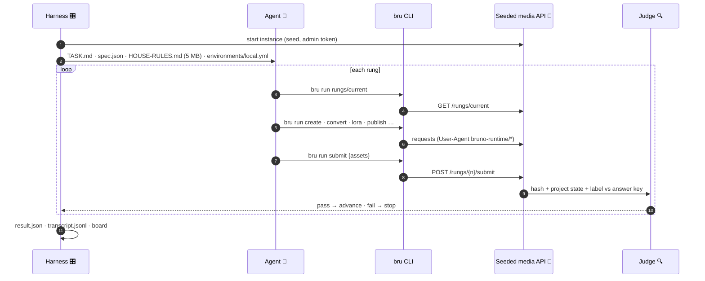
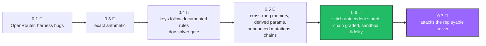

# 🔬 Bruno QUAERE

**Quantitative Unseen Agentic Endpoint Reasoning Evaluation.**
*Latin* quaere, *"to seek, to ask"*, the root of *query*. Pronounced roughly "KWY-reh."

<div align="center">

[](package.json)
[](package.json)
[](docs/ARCHITECTURE.md)
[](docs/ARCHITECTURE.md)
[](package.json)

</div>

> 🚧 **Status, 2026-09-13.** Ladder **0.6.0** is the first version where every rung is graded
> as written; its full seven-model round is below. Ladder **0.7.0** is built and in its
> verification pass; no model has climbed it yet. Every earlier round is kept under its version
> number and marked superseded. The design promise "no current model past rung 30" did not
> survive contact with 2026 models and is no longer claimed.

## 🧒 Like you're five

**Why does this exist?** People keep asking which AI is best, and the usual tests are like
spelling bees: the AI has already seen the words. This is a test where the words are made up
fresh every time, so the only way to win is to actually read and think. It exists so the answer
to "which one is best" is true, not memorized.

**What does it do?** It hands the AI a recipe book that is five hundred pages long, badly
organized, and completely correct, then asks it to cook a hundred dishes that get harder one
after another. A machine tastes every plate and says yes or no; no person and no other AI
ever tastes. Once a dish is wrong, the AI is out, and its score is how far it got.

**What does it use?** One kitchen tool only: Bruno, the little program that sends web requests,
plus a plain notepad to write in. Everything the AI cooks is fake but exact, like a Lego picture
that is the same bricks every time, so the machine can check it brick for brick. Seven different
AIs each get their own kitchen with their own fresh recipe book.

**Why is it hard?** The recipe book has old crossed-out numbers next to the real ones and you
must notice which is newer. Dish forty needs something you cooked at dish twelve and nobody
repeats the measurement. Sometimes the oven changes its own settings and you have to notice.
Sometimes the recipe asks for something the house rules forbid, and the right answer is to say no.

**What should you take from the scores?** How far an AI got is how many hard, checkable things
it did right in a row, with no help and no hints. The gaps between AIs on the same version are
real, and the transcript shows exactly where and why each one fell. Watching the same AI on the
next, harder version tells you whether it reasons or just found a trick.

**What should you not take from them?** One climb is one roll of the dice; the same AI went from
the top to rung five on two different days. Numbers from different ladder versions cannot be
compared, and older versions had bugs of ours that cut good climbs short. A perfect score means
the AI beat this version of the test, not that it is smart in general, and the next version is
built to take that score away.

## 🎯 What it is

A seeded, deterministic **media API** (images, audio, video rendered byte-for-byte from JSON)
plus a **hundred-rung task ladder** written in plain language. An AI agent climbs it using only
the Bruno CLI (`bru`) and a dumb editor, reading a **5 MB deliberately sloppy house-rules
document** whose every fact is correct and buried. The judge is `bru run` plus **sha256 hash
equality** on rendered bytes and, from rung 50 up, the project state and label the task demanded.
No model ever grades anything.

## 📚 Table of contents

| | | |
|---|---|---|
| [🧒 Like you're five](#-like-youre-five) | [📊 Results](#-results) | [🧭 How a climb works](#-how-a-climb-works) |
| [🚦 Gates](#-gates-before-any-paid-climb) | [🖥️ Lineup and drivers](#️-lineup-and-drivers) | [🚀 Quick start](#-quick-start) |
| [⌨️ CLI](#️-cli) | [🪜 Ladder history](#-ladder-history) | [🧠 What 0.7.0 changes](#-what-070-changes) |
| [📁 Layout](#-layout) | | |

## 📊 Results

### Ladder 0.6.0, round four (seeds 700-706, one attempt each, caffeinated, 6 h wall)

| 🏁 | Model | Driver | Rung | Turns | Novel tokens | Wall | Fell on |
|---|---|---|---|---|---|---|---|
| 🥇 | gpt-6-astra | codex CLI | **99, cleared** | 3733 | 0.37M | 66 min | |
| 🥇 | deepseek-flash | direct API | **99, cleared** | 1740 | 0.93M | 96 min | |
| 🥉 | qwen3.8-max | qwen CLI | 74 | 1111 | | 135 min | hash at 75, chain checks true |
| | claude-fable-5.1 | `ai` (Claude Code) | 70 | 1060 | 0.27M | 33 min | its own script's silent error at 71 |
| | gemini-3.8-flash | Google direct | 59 | 1328 | 0.75M | 61 min | drafted the conditional write, never ran it |
| | x-ai/grok-4.6 | OpenRouter | 39 | 504 | 0.25M | 38 min | ignored a page-size anomaly at 40 |
| | kimi-k3 | kimi CLI | 2 | 25 | 0.12M | 9 min | lost a variable handoff, submitted rung 0's hash |

Zero rule violations, zero admin probes, zero resumes across all seven. Every fall was a wrong
hash with both chain checks passing. **One attempt per model is noise** (qwen went 99 on one
ladder and 5 on the next); the published board will be the median of three once a version holds.
`board.md` is regenerated from `runs/` by the CLI and the same data is available as JSON.

<details>
<summary>📜 Superseded rounds (kept, never rescored)</summary>

| Ladder | Round | What it measured | Why superseded |
|---|---|---|---|
| 0.1 | OpenRouter, 7 models | kimi 11, gemini 44, astra 59 (cut by a context bug) | novel-token budget and context trimming did not exist |
| 0.3.0 | native CLIs | astra 24, grok 23, fable 16, deepseek 15, gemini 9, kimi 5, qwen 5 | an undocumented rounding rule decided 28% of resize rungs |
| 0.4.0 | native CLIs | **qwen 99**, kimi 94 (wall), fable 71, gemini 69, grok 59, deepseek 57, astra 29 | rungs differed in size, not kind; one script climbed eighty |
| 0.5.0 | native CLIs | **astra 99**, gemini 59, grok 40, kimi 25; three 59s voided | rung 60's antecedent was unstated; rungs 50+ were graded on scenery |
| 0.6.0 round three | native CLIs | astra 63, fable 52, gemini 43 in 26 minutes each | the laptop slept; void as a ceiling, valid as a rate |

</details>

## 🧭 How a climb works



| Axis | What is measured | Where |
|---|---|---|
| 🧠 Advanced reasoning | unit math, rounding order, derived parameters, a skill that overrides the spec | the rung text and the house rules |
| 🔌 API calling | 16 HTTP behaviors, exact parameter fidelity, planted spec lies | the API and the trap column |
| ⏳ Long session | one agent, no subagents, 3M novel-token budget, cross-rung recall, context that outlives the window | the ladder's length and the collection on disk |

**The one rule:** nothing but `bru` opens a socket. A native CLI has a shell, so the rule is
enforced by detection: the API logs every User-Agent, anything that is not `bruno-runtime/*` is
a violation, and `axios/*` from bru's own script sandbox is counted separately. Neither voids a
run silently; both are published.

## 🚦 Gates before any paid climb

| Gate | What it proves | Test |
|---|---|---|
| ✅ Reference climb | a scripted solution clears all 100 rungs on seeds 1, 2, 3 and a fresh seed | `test/reference.test.js` |
| ✅ Clean-room doc-solver | a solver written from the docs alone, never reading the generator, agrees with the key on seeds 1-20 and the round's seed block | `test/docsolver.test.js` |
| ✅ Sandbox fidelity | the reference climbs using only files found in a prepared sandbox | `test/sandbox-fidelity.test.js` |
| ✅ Rules in the document | every skill-marked rule in `docs/RULES-*.md` appears in the clean skill and the 5 MB sloppy one | `test/skill-rules-subset.test.js` |
| ✅ Generation bounds | keys for 300 seeds under 2 s and 2 MB | `test/keygen-bounds.test.js` |
| ✅ Behaviors | 16 behaviors proven with `bru run` against a live instance | `scripts/run-behaviors.sh` |
| ✅ Rung-0 smoke | every driver produces `result.json` for rung 0 | `--max-rung 0` |

The first two exist because the reference gate is blind to undocumented rules: it shares the
generator's code. Twice it certified rungs no correct agent could pass (a float artifact, then a
hidden rounding). The third exists because the doc-solver proves a key is derivable, not that
the sandbox contains what the docs promise.

## 🖥️ Lineup and drivers

| Model | Driver | Notes |
|---|---|---|
| claude-fable-5-1 | `--driver cli --cli ai` | Claude Code via the `ai` wrapper, fresh `CLAUDE_CONFIG_DIR` |
| gpt-6-astra | `--driver cli --cli codex` | fresh `CODEX_HOME` with only the auth file |
| qwen3.8-max | `--driver cli --cli qwen` | fresh `HOME`, env from `~/.qwen/.env` |
| kimi-code/k3 | `--driver cli --cli kimi` | model id must carry the `kimi-code/` prefix |
| gemini-3.8-flash | `--driver google` | the Gemini CLI silently serves 3.5-flash for any 3.8 id |
| deepseek-flash | `--driver deepseek` | the only flash id DeepSeek's API serves |
| x-ai/grok-4.6 | `--driver openrouter` | while the x.ai key is team-blocked |

Every CLI runs from an isolated home with only its credentials, so no user skills or memories
climb with it. Each adapter records the model the tool actually served; a mismatch voids the run.

## 🚀 Quick start

```bash
npm test                                   # ~30 min, all gates
node bin/quaere.js serve --seed 42         # public + admin ports; admin needs X-Admin-Token
node bin/quaere.js reference --seed 42     # scripted climb, must print 100/100
node bin/quaere.js rung --seed 42 --n 60   # a task in plain language (--answer shows the key)
node bin/quaere.js skill --seed 42 --mode sloppy --bytes 5000000 > HOUSE-RULES.md

# one real climb (keys exported per process; caffeinate so the laptop cannot sleep it away)
caffeinate -i -s node bin/quaere.js run --driver cli --cli codex --model gpt-6-astra \
  --seed 801 --attempts 1 --skill-mode sloppy --skill-bytes 5000000 --wall-ms 21600000
node bin/quaere.js board runs/ > board.md
```

`node --test` exits 0 even when tests fail. Write its output to a file and read the
`# pass` / `# fail` lines; never trust an exit code.

## ⌨️ CLI

| Command | Purpose |
|---|---|
| `serve --seed N [--port P --admin-port A]` | run one seeded instance |
| `spec --seed N` | OpenAPI document, with the seed's planted lies |
| `skill --seed N [--mode clean\|sloppy --bytes B]` | the house rules, clean or 5 MB sloppy |
| `rung --seed N --n K [--answer]` | one task's text, optionally its answer key |
| `reference --seed N [--from A --to B]` | the scripted reference climb |
| `run --driver D [--cli C] --model M --seed N …` | one agent climb; see flags below |
| `board runs/ [--json out.json]` | the board grouped by ladder version |

<details>
<summary>⚙️ <code>run</code> flags</summary>

| Flag | Default | Meaning |
|---|---|---|
| `--attempts` | 1 | fresh-context attempts per model |
| `--budget` | 3000000 | novel-token cap per attempt (output plus new input per turn) |
| `--skill-mode` / `--skill-bytes` | sloppy / 5000000 | which house-rules document the sandbox gets |
| `--wall-ms` | | active-time wall; suspended time (sleep) is excluded |
| `--max-rung` | 99 | stop after this rung passes (smokes use 0) |
| `--max-turns` | 5000 | `bru` requests before `stoppedBecause: turns` |
| `--context-limit` | 160000 | message-loop drivers trim before this many tokens |
| `--max-output-tokens` | 32768 | output budget for reasoning models |

</details>

## 🪜 Ladder history



Every version is a dated addendum in [`docs/ARCHITECTURE.md`](docs/ARCHITECTURE.md), which
records each rule and the bug that changed it. The rules the answer key may depend on live in
[`docs/RULES-0.6.md`](docs/RULES-0.6.md) (0.7.0 renames it).

## 🧠 What 0.7.0 changes

A forensic read of Astra's clear showed **261 lines of Python, written in 23 tool calls, replayed
for the last 51 calls with no new code**. It parsed the rung text with literal regexes, read the
5 MB skill once and cut it to 34 KB by dropping sections by heading name, and never saw a
mutation because all 33 landed on routes its pipeline never read. 0.7.0 breaks each assumption
that made replay possible:

| # | Change | Who pays |
|---|---|---|
| 1 | clause kinds rendered in four or more seeded phrasings; the rules publish obligations, never surface strings | replayers only |
| 2 | mutations land on the fields a solver must parse, re-picked per rung | replayers, and anyone who ignores what came back |
| 3 | ETag, next cursor, Retry-After live in headers only | one-time client fix |
| 4 | dated rule amendments written into the sandbox's skill file at rungs 30, 55, 78 | everyone, a few turns each |
| 5 | true rules planted inside the noise-headed sections a heading filter deletes | heading filters only |
| 6 | regression rungs: rebuild an earlier piece under amended rules | forward-only ledgers |
| 7 | refusal rungs: the text asks for something a house rule forbids; graded by absence | dispatchers that execute every clause |
| 8 | byte-budget search over live responses | everyone, a few turns |
| 9 | short pages under throttle that undercount silently | naive loops |
| 10 | the path is graded: ordered stage audit, HMAC bound to the artifact's digest | one-line HMAC helpers |
| 11 | fresh reels per batch rung, so the top third is hard rather than long | nobody; it returns turns |

Two new board columns, **code writes** and **doc reads**, separate templating from reasoning
better than turns do.

## 📁 Layout

```
src/ladder/      grammar, rung text, reference climb, clean-room doc-solver
src/api/         the seeded media API, admin port, behaviors
src/harness/     drivers (message-loop and native CLI), supervisor, scoring, board
src/render/      deterministic SVG, PNG, WAV, QVID
docs/            ARCHITECTURE.md (contract + addenda), RULES-*.md, SPEC.md, ARENA.md
collections/     the 16-behavior Bruno collection
runs/            results and transcripts per model, seed, attempt (gitignored)
```

---

🐶 *Built as the unseen row of the Bruno API Arena. Latin for "ask"; measured in rungs.*
