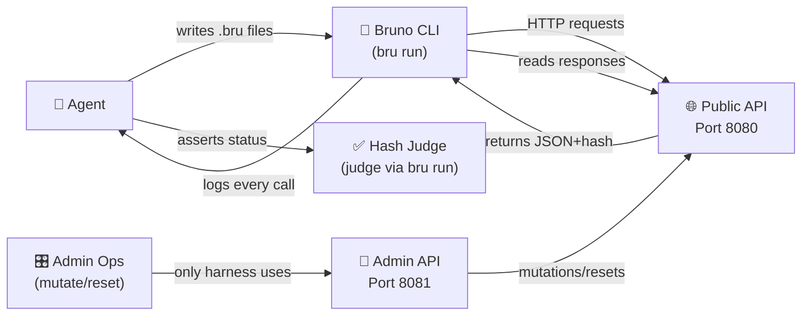

# 🔬 Bruno QUAERE

**Quantitative Unseen Agentic Endpoint Reasoning Evaluation**  
*Latin: quaere, "to seek, to ask" — the root of query.*

<div align="center">

[](#-quick-start)
[](#-architecture)
[](#-architecture)
[](#-seeding)
[](#-docker)
[](#-license)

</div>

## 🎯 What it does

A purpose-built media API whose only job is to be figured out. It creates images, audio, and video from deep JSON specs, converts, combines, and diffs them — **and every artifact is deterministic**: same params, same bytes. Every instance is seeded, so no model can memorize it. Every trap is designed, so the score means something.

Agents get one tool: the **Bruno CLI**. One skill file that explains how the house does things. One ladder of **a hundred tasks** that get harder until they fall off. The transcript of the climb is the product demo.

**QUAERE is the permanent unseen row in the [API Arena](docs/ARENA.md).** Borrowed APIs measure recall. This one measures **reading**.

---

## 📚 Table of Contents

<div align="center">

| Core | How | Reference |
|------|-----|-----------|
| [🤔 Why Purpose-Built](#-why-purpose-built) | [🏗️ Architecture](#-architecture) | [📖 CLI Reference](#-cli-reference) |
| [💾 The One Rule](#-the-one-rule) | [🪜 How to Climb](#-how-to-climb) | [🎯 Scoring](#-scoring) |
| [📊 The Three Axes](#-the-three-axes) | [🧠 The Skill is Rosetta](#-the-skill-is-rosetta) | [🎲 Seeding](#-seeding) |
| [⚡ Budget & Rules](#-budget--single-agent-rule) | [🐚 The Sandbox](#-sandbox--editor-only) | [📈 Live Results](#-live-results) |

</div>

---

## 🤔 Why Purpose-Built

| Borrowed API | QUAERE |
|---|---|
| 🎯 Unseen until first board, then training data | 📌 Shape is public, instance is seeded per run, never the same twice |
| 📝 Spec is whatever vendor wrote | ✅ Spec lies on purpose in known places; catching lies is scorable |
| 🔧 Mutations need a proxy in front | 🎛️ Mutations are native, flipped on admin port (model cannot reach) |
| 🏗️ One shared sandbox; probing by one model dirties another's state | 🔒 One instance per model per run, own port, own seed |
| 📅 Vendor can change mid-season | 🔐 Pinned by version and seed; reproducible forever |

---

## 🏗️ Architecture



**The run loop:** agent writes `.bru` request files → `bru run` executes them → API responds with JSON + content hash → agent asserts on status, headers, and hash → advance rung or fall off.

---

## 💾 The One Rule

The sandbox the agent runs in has **exactly one binary that can open a socket: `bru`**. 

No curl. No Python. No node.

- The agent writes `.bru` request files and environment files
- Runs `bru run`
- Reads the output
- Repeats

Every invocation is logged with its arguments and output. **That log is the deliverable.** It is a recording of an agent learning an API through Bruno alone, and every published run is a worked example of the CLI doing real work.

---

## 📊 The Three Axes

Every design choice serves one of these:

| Axis | What's Measured | Why It Matters |
|------|---|---|
| 🧠 **Advanced Reasoning** | Quant operations (units, color, timeline, compounding) + interpreting a long skill file that overrides spec defaults | Can the model do math, or just autocomplete? |
| 🔌 **API Calling** | Sixteen HTTP behaviors a competent consumer handles + exact parameter fidelity on deep JSON specs | Does it read the spec, or does it guess? |
| 🏔️ **Long Session** | A hundred rungs under 3 million token budget with one agent and no subagents | Can it survive a context reset, or does it memorize everything? |

**The judge:** `bru run` + hash equality. No AI ever grades. Media is deterministic so that holds.

---

## 🧠 The Skill is Rosetta Stone

Tasks are written in plain language:
> "Make an image 12 by 22 inches with a transparent background using Jenny's lora."

Nothing in the spec says inches. The skill file says:
- The house DPI is 300
- Transparency lives under `canvas.background`
- Loras are looked up by name at an endpoint that only appears in a `links` block
- Dimensions round to the nearest multiple of 8

**That is the measurement:** Can the agent read a long, real-shaped skill and apply it, rather than autocomplete from the spec?

The skill is generated from the seed too, so house rules differ per instance, and it deliberately overrides spec defaults in a few places so "did it read the skill" has a checkable answer.

---

## 🪜 How to Climb

### The Ladder

A hundred rungs, stop at the first failure. Rungs are **not hand-written** — a difficulty grammar composes each from primitives, and the seed picks the concrete task. No two runs climb the same ladder and the harness always knows the answer because it built the question.

<div align="center">

| Rungs | Steps | Params/Step | Skill Lookups | Quant Ops | Behaviors in Play |
|---|---|---|---|---|---|
| 0-9 | 1 | 3-6 | 0-1 | 0-1 | auth, create |
| 10-19 | 2 | 6-10 | 1-2 | 1-2 | + convert, idempotency |
| 20-29 | 3 | 8-12 | 2 | 2 | + combine, lora lookup |
| 30-39 | 3-4 | 10-14 | 2-3 | 2-3 | + diff, etag |
| 40-49 | 4-5 | 12-16 | 3 | 3 | + pagination batch, rate limit |
| 50-59 | 5 | 14-18 | 3-4 | 3-4 | + async render, state machine |
| 60-69 | 5-6 | 16-20 | 4 | 4 | + token expiry mid-chain, HMAC publish |
| 70-79 | 6-7 | 18-22 | 4-5 | 5 | + content negotiation, soft delete |
| 80-89 | 7-8 | 20-24 | 5 | 5-6 | + live trap must be caught to pass |
| 90-99 | 8-10 | 22-28 | 5-6 | 6-7 | everything, three rounding rules in order |

</div>

### Quant Operations (All Deterministic, All Checkable)

- 📏 Unit conversion at a house DPI, with a stated rounding rule
- 🎨 Color math: hex to HSL, shift by a percentage, back to hex
- 📐 Aspect ratio locks and letterboxing
- 🔊 Sample rate × duration = frames; bitrate budgets ("fit under 2 MB")
- 🎭 Compounding: "each layer 10% more opaque than the one before it"
- 📊 Percent-of-parent sizing across nested layers
- ⏱️ Timeline math: offsets, overlaps, and total duration across clips

---

## 🎭 Behaviors (16 Total)

<details open>
<summary><strong>Click to expand the sixteen behaviors a competent API consumer handles</strong></summary>

| # | Behavior | What It Tests | Skill It Maps To |
|---|---|---|---|
| 1️⃣ | Cursor pagination, opaque cursors, last page signaled by missing cursor (not empty array) | Loops that stop correctly | Pagination |
| 2️⃣ | Bearer token with 60-second TTL and refresh endpoint | Chaining requests, pre-request scripts | Auth lifecycle |
| 3️⃣ | `Idempotency-Key` on POST: same key returns same resource, no key creates duplicate | Reading a header's contract, not just its name | Idempotency |
| 4️⃣ | 429 with `Retry-After`, budget resets on the second | Backoff, not retry storms | Rate limits |
| 5️⃣ | `ETag` with `If-None-Match` 304 on reads and `If-Match` 412 on writes | Conditional requests | Caching and concurrency |
| 6️⃣ | POST returns 202 and a `Location`, job must be polled to `done` | Async workflows | Long-running operations |
| 7️⃣ | Some resources reachable only by following `links` in response (absent from spec) | Reading responses, not just the spec | Discovery |
| 8️⃣ | Same path returns JSON or CSV by `Accept` | Content negotiation | Headers |
| 9️⃣ | Errors are `application/problem+json` with field-level detail on 422 | Asserting on error shape | Error handling |
| 🔟 | A spec-listed route 301s to a new path | Following redirects, updating the collection | Deprecation |
| 1️⃣1️⃣ | Spec says `created_at`, API returns `createdAt` | **Catching a spec lie** | Contract testing |
| 1️⃣2️⃣ | Spec says 200 on delete, API returns 204 | **Catching a spec lie** | Contract testing |
| 1️⃣3️⃣ | Draft, compose, render, publish: state machine returns 409 out of order | Multi-step workflows | Sequencing |
| 1️⃣4️⃣ | `/workspaces/{w}/projects/{p}/assets`: ids only discoverable by listing parent | Nested resources | Hierarchy |
| 1️⃣5️⃣ | One endpoint requires `X-Timestamp` + HMAC signature over it (using API secret) | Scripting in pre-request | Request signing |
| 1️⃣6️⃣ | Soft-deleted rows hidden by default, visible with `?include_deleted=true` | Reading query parameter semantics | Filters |

**Note:** Items 11 and 12 are **traps** 🪤. A season has ≥2 live traps and never reveals which.

</details>

---

## 🎯 Scoring

| Name | Definition |
|---|---|
| **Rung** 🏔️ | Highest rung passed clean, median of three runs. **The score.** |
| **Turns** 🔄 | `bru run` invocations to reach that rung. **The tiebreak.** |
| **Fidelity** ✅ | Share of parameters set correctly across every attempt, including failed rungs |
| **Trap** 🪤 | Share of planted spec lies the collection's tests flagged |
| **Tokens** 💰 | Spent of the 3 million, and how many rungs per million. Reported. |
| **Time, Cost** ⏱️ | Wall clock, dollars at list price. Reported, not scored. |

**Why wall clock is not scored:** Time up the ladder is dominated by provider latency and rate limits, so scoring it ranks infrastructure, not the model. **Turns** measures the same thing honestly: how many calls it took to figure the API out.

---

## ⚡ Budget & Single-Agent Rule

- 🎬 **3 million tokens per run**, input + output, hard cap. The run ends where the budget does.
- 🧑 **One agent, one context.** No subagents, no parallel workers, no delegation. The instructions say so and the harness enforces it: one model session, one API key, one instance.
- 🏔️ **The ladder is longer than any context window.** That is on purpose. Somewhere between rung 30 and rung 60 the agent will have to compact or clear its own context and keep climbing.

**How it survives:** The Bruno-shaped answer is sitting on disk the whole time. The collection the agent writes is its memory of the API: every request it got right, every variable it learned, every test that encodes a house rule. An agent that treats the repo as its notebook climbs through a context reset. An agent that kept everything in its head falls off.

---

## 🎲 Seeding

One integer seed per instance controls:

- 🔤 Entity vocabulary (orgs, projects, keys in one world; fleets, vehicles, sensors in another)
- 🆔 ID formats (UUID, ULID, prefixed like `proj_…`, plain integers)
- 📛 Field naming convention (snake, camel, and which fields break the convention)
- 🪤 Which traps are live and where
- 🚫 Which routes are deprecated
- 🔐 Cursor encoding
- 💾 Rate limit budget
- ⏱️ Token TTL

**The spec is generated from the same seed**, so it matches the instance except where a trap says otherwise. Two instances with the same seed and version are **byte-identical**. That is what makes a result reproducible.

---

## 🐚 Sandbox & Editor Only

The agent gets five tools, not just `bru`:

| Tool | Args | Limits | Purpose |
|---|---|---|---|
| `bru` | `{args}` | The CLI, the only thing that reaches the network | Make HTTP calls |
| `write_file` | `{path, content}` | Inside sandbox only | Author request files |
| `read_file` | `{path, offset, limit}` | Max 200 lines per call | Read skill & responses |
| `grep` | `{pattern, path}` | Regex, max 100 hits | Search 5 MB skill file |
| `ls` | `{path}` | Inside sandbox only | List files |

**No shell. No pipes. No `cat`.** Finding the DPI in 5 MB means choosing search terms well, reading the hits, and noticing that three of them are decoys. That is on the reasoning axis.

---

## 📈 Live Results

```
| Model | Rung | Turns | Fidelity | Trap | Tokens | Wall ms |
|---|---|---|---|---|---|---|
| 🤖 anthropic/claude-sonnet-5 | 2 | 63 | 89.5% | 0.0% | 1,905,687 | 320,660 |
```

**Expected vs produced at the fall rung:**
- **anthropic/claude-sonnet-5**: fell at rung 3
  - Expected hash: `1156febfe003a96a02bb671eadb7e0ca8e37d921380657a57fad040f05fe1f21`
  - Produced hash: `eca23715e1291388c02062df41c1612acea4becadf0465f1c7f68dd151bf8bf1`
  - Fidelity: 57.9%

---

## 🔬 Calibration: Hard, Picky, and Provably Solvable

### The Target

**No current model passes rung 30.** The ladder is built for the next five years of models, not this year's. If a frontier model clears 30 in the private dry run, the curve is too easy and gets steepened **before** season one publishes, never after.

### Picky Means Picky

A rung passes only on **exact hash equality** for every artifact in the task. No partial credit inside a rung. 

- A rounding rule applied out of order ❌
- An opacity off by 1% ❌
- A layer in wrong z-order ❌
- A field named in wrong case ❌
- A cursor loop that stopped one page early ❌

All of these are a fall, and the board shows the expected artifact next to what the model produced so the miss is visible.

### Two Guardrails

**Every rung has a reference solution** the harness executes before any model does. A scripted climb, written from the skill and the spec alone, that passes all hundred rungs on every seed. A rung the reference cannot pass is a bug in the generator, not a hard task. **Nothing is published that the reference has not cleared.**

**The bottom thirty rungs must spread the field.** A board where every model sits between 12 and 28 is as useless as one where they all sit at 100. Rungs 0–30 rise steadily enough that:
- A weak model falls at 8
- A mid model at 17
- A frontier model at 26
- The gaps are legible

Rungs 31–100 are headroom, and the first model to clear 50 is a headline on its own.

---

## 🚀 Quick Start

### Prerequisites

- **Node 22+**
- **Bruno CLI** (the agent's tool)
- Docker (for serving the API)

### Local Development

```bash
# Install dependencies
npm install

# Run tests (includes reference climb on seeds 1, 2, 3)
npm test

# Serve a local instance on port 8080 (admin on 8081)
quaere serve --seed 42

# Generate spec for seed 42
quaere spec --seed 42 > spec.json

# Generate skill for seed 42
quaere skill --seed 42 > SKILL.md

# Get a single rung's task (with answer)
quaere rung --seed 42 --n 5 --answer

# Run the reference (scripted agent) against seeds 1, 2, 3
quaere reference --seed 42

# Run a real model (requires API keys)
quaere run --driver anthropic --model claude-sonnet-5 --seed 42 --attempts 3

# Generate board from run results
quaere board runs/ > board.md
```

### Docker

```bash
# Build the image
docker build -t quaere:0.1.0 .

# Run an instance with seed 42
docker run -e SEED=42 -p 8080:8080 -p 8081:8081 quaere:0.1.0

# The API is now at localhost:8080
# Admin port (loopback only) is at localhost:8081
```

---

## 📖 CLI Reference

```bash
quaere serve [--seed 42] [--port 8080] [--admin-port 8081]
  Start the API server pair (public + admin).

quaere spec [--seed 42]
  Generate OpenAPI 3.1 JSON spec (with lies applied).

quaere skill [--seed 42]
  Generate house skill file (200-400 lines, clean).

quaere rung [--seed 42] --n 37 [--answer]
  Print rung 37's task text.
  With --answer, also print the plan and expected descriptors.

quaere reference [--seed 42] [--from 0] [--to 99]
  Start a server, climb the ladder, report pass/fail per rung.
  This is the gate: a rung the reference cannot pass is a generator bug.

quaere run \
  --driver anthropic \
  --model claude-sonnet-5 \
  --seed 42 \
  --attempts 3 \
  [--budget-tokens 3000000]
  Climb with a real model (one agent, three context windows).

quaere board <runs-dir> > board.md
  Generate markdown board from run results.
```

---

## 🏗️ Architecture Overview

```
bruno-quaere/
├── src/
│   ├── seed.js                    # PRNG & sub-seeding (core)
│   ├── canon.js                   # Canonical JSON, SHA256, hashing (core)
│   ├── world.js                   # Seed → World (vocab, rules, traps) (core)
│   ├── routes.js                  # Route table, pure data (core)
│   ├── render/                    # Media renderers (core)
│   │   ├── image.js               # Shapes → SVG → PNG bytes
│   │   ├── audio.js               # Notes → WAV → QA8 bytes
│   │   └── video.js               # Timeline → QVID bytes
│   ├── media.js                   # create/convert/combine/diff/lora (core)
│   ├── api/                       # HTTP server (api)
│   │   ├── server.js
│   │   ├── router.js
│   │   ├── auth.js
│   │   ├── behaviors.js
│   │   ├── resources.js
│   │   ├── problem.js
│   │   └── admin.js
│   ├── spec.js                    # World → OpenAPI 3.1 + lies (spec)
│   ├── skill.js                   # World → SKILL.md text (spec)
│   ├── ladder/                    # Rung generation (ladder)
│   │   ├── grammar.js
│   │   ├── rung.js
│   │   └── reference.js
│   └── harness/                   # Agent runner (harness)
│       ├── sandbox.js
│       ├── drivers/
│       │   ├── anthropic.js
│       │   └── openai.js
│       ├── run.js
│       ├── score.js
│       └── board.js
├── bin/
│   └── quaere.js                  # CLI entry point
├── collections/
│   └── behaviors/                 # Proof-of-behavior OpenCollection
├── test/                          # node:test, one file per module
├── docs/
│   ├── SPEC.md
│   └── ARCHITECTURE.md
├── Dockerfile
└── package.json
```

**Ground rules for code:**
- ESM, Node 22+, **zero runtime dependencies** (only `node:` modules)
- Determinism everywhere: same seed and version = same bytes
- Every module exports pure functions over plain objects (except HTTP server)
- Small files, one concern per file
- Errors in RFC 9457 `application/problem+json`

---

## 📋 What It Is Not

- 🚫 **Not a product feature.** It is a benchmark harness and a Docker image.
- 🚫 **Not hosted.** No public instance anyone can log in to. Anyone who wants one runs the image.
- 🚫 **Not AI.** Bruno grades. The model competes. Same framing as `ARENA.md`.

---

## 🔗 Related Documents

- 📖 [**docs/SPEC.md**](docs/SPEC.md) — Full specification, seeding, behaviors, ladder details
- 🏗️ [**docs/ARCHITECTURE.md**](docs/ARCHITECTURE.md) — Module map, type definitions, API surface, CLI reference
- 📊 [**board.md**](board.md) — Live results from model runs

---

## 🎪 Fun Facts

- 🎬 The run loop is the deliverable—not a score, the **transcript**
- 🧠 Long sessions measure context discipline, not model size
- 🎭 Sixteen behaviors woven in; two are traps every season
- 🔐 Deterministic media means no AI ever grades (hash equality only)
- 📚 The skill file is the Rosetta stone—reading it carefully is the test
- 💾 One seed, byte-identical forever
- 🏔️ The ladder is longer than any context window on purpose

---

## 📄 License

MIT. See [LICENSE](LICENSE) for details.

---

<div align="center">

**Built with 🔍 determinism, 🎭 traps, and 🏔️ the longest ladder.**

*The media API whose only job is to be figured out.*

</div>
